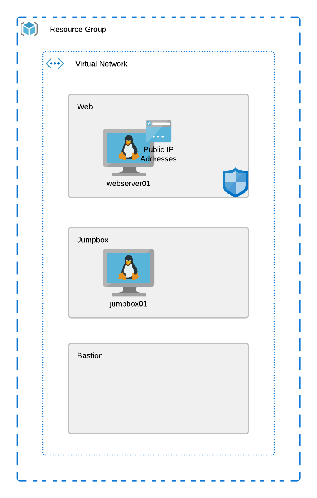

# Checkpoint #2

 - Build on the Terraform code
 - Replace hard coded values with variables, things like names, skus, locations, etc.
 - Use variables, locals, and tfvars/secrets as well
 - Use a remote provisioner to configure the linux web server
 - Use a remote provisioner to install updates and nginx
 - Add some tags for your resources, ie: deployedBy: Terraform, BU: IT
 - Use the file provisioner to copy a file to the web server as well

# Objective

 - Review the code, make sure all static values are replaced with variables so the code could be re-used.
 - Make sure the provisioner is running and configuring the server for you
 - Have a project that will spin up and allow you to connect to the webserver on port tcp/80

## Azure Resources:
 - Resource Group
 - Virtual Network
 - Subnets
 - Linux Virtual Machines
 - Public IP Address
 - Network Security Group

 ## Azure Refrence Architecture

 