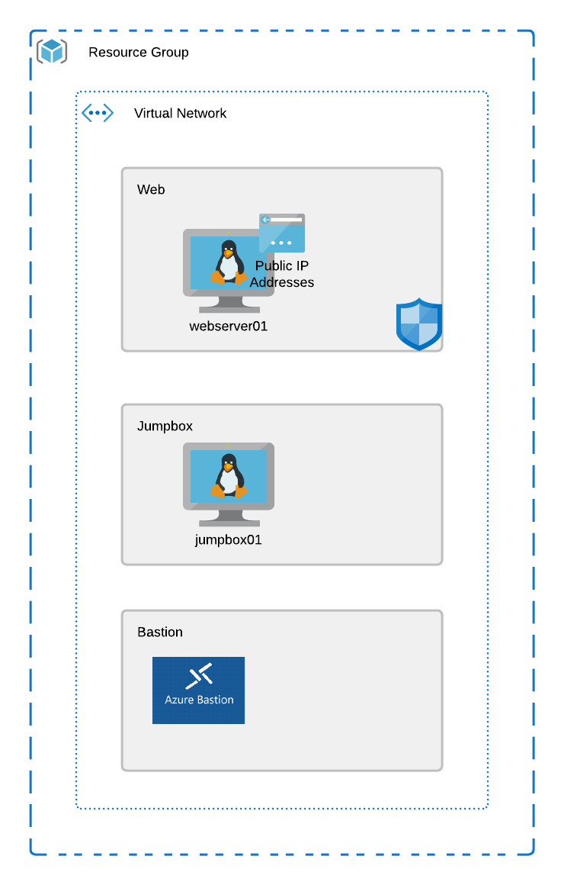

# Checkpoint #4

Now that we have a simple module, lets add a new resource to the project, this time using only a module. Add a bastion service to the bastion subnet, this will be used to access the jumpbox machine in the project.

# Objective

 - Create a new bastion service module
 - Use the bastion module in your project and deploy the service to the bastion subnet
 - Test that you can access your jumpbox using the bastion service post deployment

## Azure Resources:
 - Resource Group
 - Virtual Network
 - Subnets
 - Linux Virtual Machines
 - Public IP Address
 - Network Security Group
 - Azure Bastion Service

 ## Azure Refrence Architecture

 