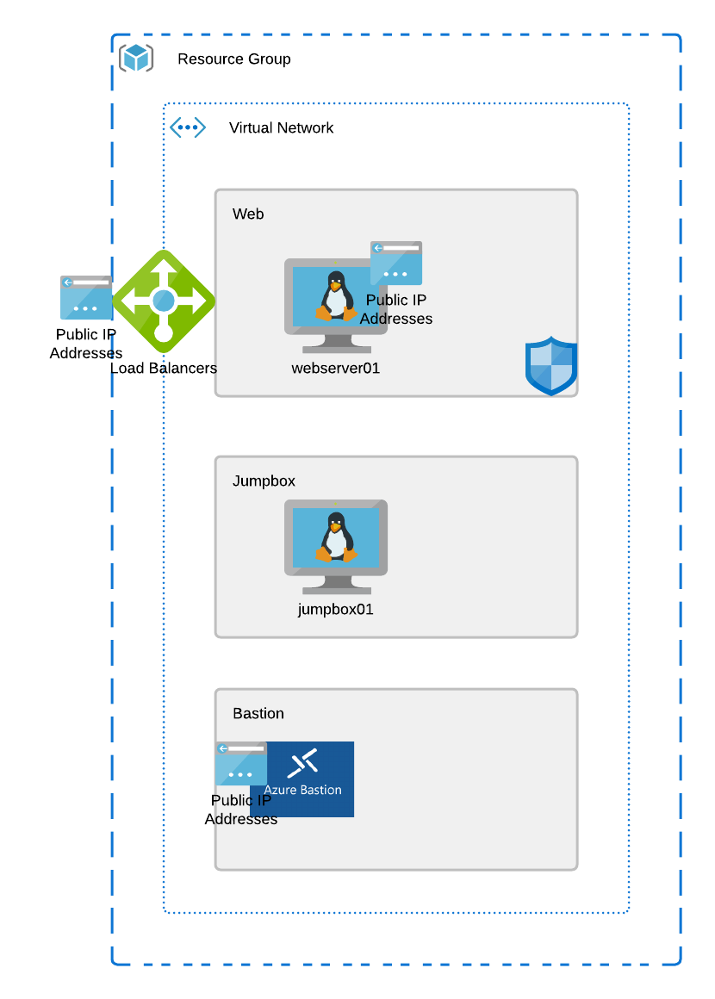

# Checkpoint #5

Lets add a load balancer to the project. Even though we only have a single VM, we can go through the process of adding the load balancer to distribute the load between if we add another server later. Create a module that will create a public standard load balancer and add your web server to the backend pool dynamically.

# Objective

 - Create a load balancer module
 - Create frontend public IP
 - Create LB rule for your web app
 - create health probe for your web service
 - make sure your NSG is configured correctly for the health probe AND web traffic...
 - Add your web server as a backend pool
 - Test access to your nginx page using the load balancer

## Azure Resources:
 - Resource Group
 - Virtual Network
 - Subnets
 - Linux Virtual Machines
 - Public IP Address
 - Network Security Group
 - Azure Bastion Service
 - Azure Load Balancer

 ## Azure Refrence Architecture

 