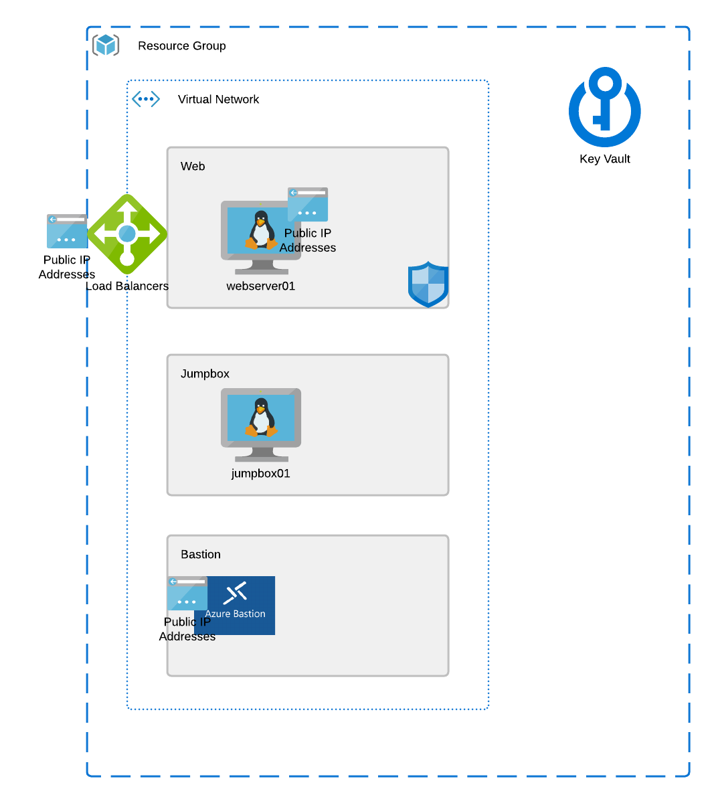

# Checkpoint #7

Up until this point, we've been storing credentials in a secure file, but its a pain to have to find the file to get the creds. Lets use the Random provider to create a random password and then store the value in a key vault.

# Objective

 - Create a key vault module
 - deploy the random password to your virtual machines, use a separate password for your jumpbox and web server
 - Store both passwords as secrets in your key vault

## Azure Resources:
 - Resource Group
 - Virtual Network
 - Subnets
 - Linux Virtual Machines
 - Public IP Address
 - Network Security Group
 - Azure Bastion Service
 - Azure Load Balancer
 - Web Servers
 - Availability Set
 - Key Vault

 ## Azure Refrence Architecture

 